# Dream Vacation Destinations

This is a full stack web application where users can search for countries they want to visit and save them to a personal list. Each entry displays the country name, its capital city, and the region it belongs to. The application is made up of three components: a React frontend, a Node.js Express backend, and a PostgreSQL database. All three run inside Docker containers and are managed through Docker Compose.

## What Was Done

The base project was a React and Node.js application with no containerization in place. The task was to take that existing codebase and make it run entirely through Docker, with all three services isolated in their own containers and able to communicate with each other over a shared network.

Several issues came up during the process that required real fixes beyond just writing configuration files.

The first issue was with the Node.js version. The React frontend uses an older version of webpack that is not compatible with the OpenSSL implementation in Node.js 18. This caused the frontend build to fail with a cryptography error. The fix was to pass the NODE_OPTIONS flag during the build step inside the Dockerfile to tell Node to use the legacy OpenSSL provider.

The second issue was that the REST Countries API the project was originally built around has been deprecated and taken offline. The backend was calling version 3.1 of that API and every request was returning a deprecation notice instead of country data, which caused the backend to crash whenever a user tried to add a country. After testing several alternatives from inside the running container, the application was updated to use the CountriesNow API for capital city data and the First.org countries API for region data. Both are free and do not require authentication.

The third issue was on the frontend side. The original code called toLocaleString() on the population field without checking whether the value existed first. Since neither of the replacement APIs returned population data, that field was stored as null in the database. When the frontend tried to render a saved entry, it crashed and left the page blank. A null check was added to the population display so it shows N/A instead of throwing an error.

A database initialisation file was also added so the destinations table gets created automatically whenever the database container starts for the first time, removing the need to create it manually.

## Project Structure

The repository contains a frontend directory with the React application, a backend directory with the Node.js API server, and Docker configuration at the project root. The backend also contains an SQL initialisation file that sets up the database table on first run.

## Requirements

Docker and Docker Compose must be installed. No other local dependencies are needed.

## Environment Setup

A .env file is required at the root of the project before running the application. Create one with the following content, updating the password to something of your choosing:

POSTGRES_USER=your_postgres_user

POSTGRES_PASSWORD=your_postgres_password

POSTGRES_DB=your_database_name

DATABASE_URL=postgresql://your_postgres_user:your_postgres_password@db:5432/your_database_name

PORT=3001

The database hostname in the connection string is set to db rather than localhost. This is because containers on the same Docker network reach each other using their service names, not localhost.

## Running the Application

From the root of the project, run:

docker compose up --build

Docker will build the frontend and backend images, pull the PostgreSQL image, create the shared network and database volume, and start all three containers. The table is created automatically on first startup.

Once everything is running, open a browser and go to http://localhost to access the application. The backend API is available at http://localhost:3001/api/destinations.

To stop the application, run docker compose down.

## Architecture

All three containers run on a custom bridge network which allows them to find each other by service name. The backend connects to the database using the service name db in its connection string, and the frontend communicates with the backend on port 3001.

The frontend image is built using a multi-stage Dockerfile. The first stage compiles the React application into static production files using Node.js. The second stage copies only those compiled files into a clean nginx image, which then serves them. The final image contains no source code or build tools, only nginx and the compiled output.

Database data is stored in a named Docker volume so it persists across container restarts. Stopping or recreating the containers does not result in data loss.

## Screenshots


*docker compose up --build completing with all three containers started successfully*


*docker ps output showing vacation_db, vacation_backend and vacation_frontend all running*


*The application running in the browser at http://localhost and countries successfully added and displayed*

# Continuous Integration and Continuous Deployment

## Overview

The Dream Vacation App now builds, tests and ships itself. Every push to the main or dev branch triggers an automated pipeline through GitHub Actions that checks the code, builds fresh Docker images for the frontend and backend, and pushes those images to Docker Hub tagged with the commit that produced them. This removes the need for any manual image building once code is merged.

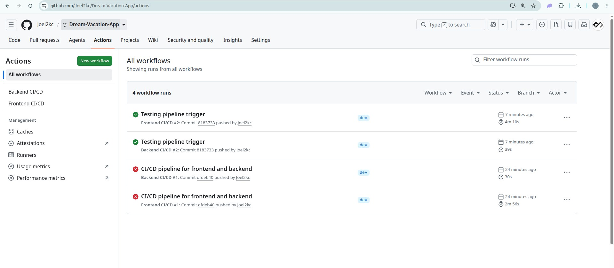
GitHub Actions tab showing the list of workflow runs

## Branching strategy

The project uses two branches to separate active development from stable code. All new work happens on the dev branch first. Changes are committed and pushed there, and the pipeline runs against every push to confirm the code builds cleanly and the images are pushed successfully before anything touches main.

Once a set of changes has been tested on dev and the pipeline has run without issues, it gets merged into main through a pull request rather than being pushed there directly. This keeps main as a reliable, working version of the app at all times, since nothing reaches it without first proving itself on dev.

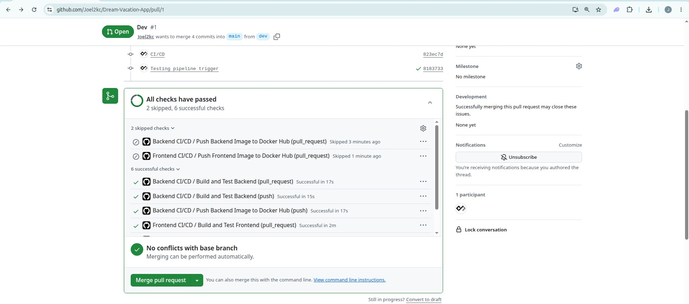

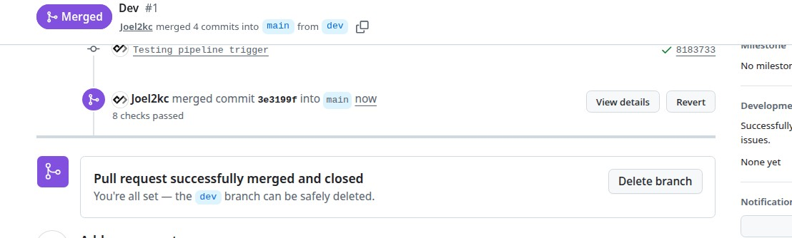
Pull Request merged dev into main

## Why two workflows

The frontend and backend are separate applications with separate dependencies, so they are handled by two independent workflow files. A change to the backend only triggers the backend pipeline, and a change to the frontend only triggers the frontend pipeline. This keeps each run fast and keeps the logs focused on the part of the app that actually changed.


## How a pipeline run works

Each workflow is split into two stages. The first stage installs dependencies, runs lint checks and any available tests, then builds the Docker image locally to confirm it compiles without errors. Nothing leaves the runner at this point. The second stage only runs after the first stage passes, and only when the trigger was a direct push rather than a pull request. This stage logs into Docker Hub and pushes the newly built image.

Keeping pull requests from pushing images is intentional. GitHub does not expose stored secrets to workflows triggered by pull requests from outside contributors, so image pushes are limited to trusted pushes on the two protected branches.

## Image tagging

Every image pushed to Docker Hub carries two tags. One is the short commit SHA that produced it, giving a permanent record of exactly which version of the code is inside that image. The other is latest, kept for convenience when pulling the newest build without needing to look up a specific commit.

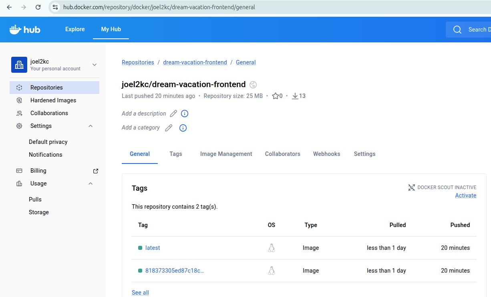

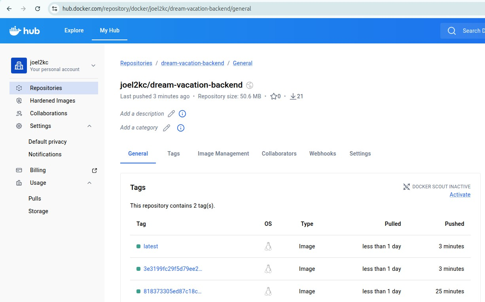
Docker Hub repository page showing the backend and frontend repositories with several tagged images listed

## Secrets

Docker Hub authentication is handled through two repository secrets, DOCKER_USERNAME and DOCKER_TOKEN. The token is a Docker Hub access token rather than the account password, generated with limited scope and revocable at any time without affecting the main account credentials.

## Local development.

Docker Compose is still used for running the full stack locally during development, bringing up the Postgres database, backend and frontend together on a shared network. The pipeline does not replace this, it automates what used to be a manual build and push step once the code is ready to leave a developer's machine.

# AWS Infrastructure and Deployment

## Overview

This part of the project moves the Dream Vacation App off a local setup and onto real AWS infrastructure. The networking was built by hand in the AWS console so every piece could be understood on its own, and the existing CI/CD pipeline was extended so that once code reaches the main branch, it also deploys itself straight to an EC2 instance.

## Networking

A custom VPC named dream_vpc was created with the range 10.0.0.0/16, along with a subnet called dream_subnet using 10.0.1.0/24. An internet gateway named dream_igw was attached to the VPC, and a route table named dream_rt was set up with a route pointing all outbound traffic to that gateway, then associated with the subnet. Together these four pieces give the subnet an actual path to and from the internet, which is what the EC2 instance depends on to be reachable later.

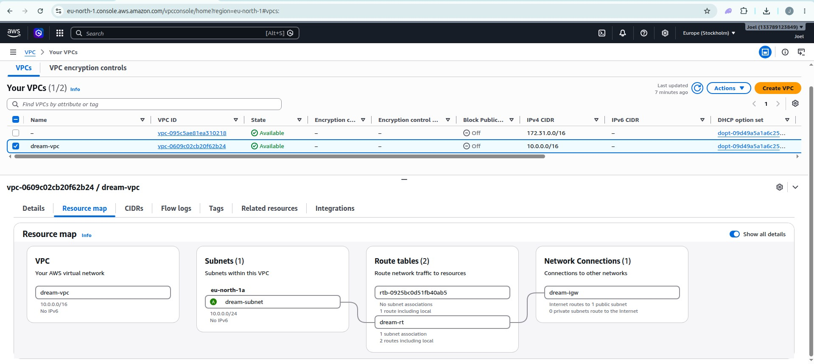

## EC2 Instance

An Ubuntu EC2 instance was launched inside dream_subnet with a public IP enabled, so it sits properly inside the custom network rather than the default one. A user data script ran automatically on first boot to install Docker and the Docker Compose plugin, meaning the server was ready to run containers the moment it came online, without needing to SSH in and install anything by hand.

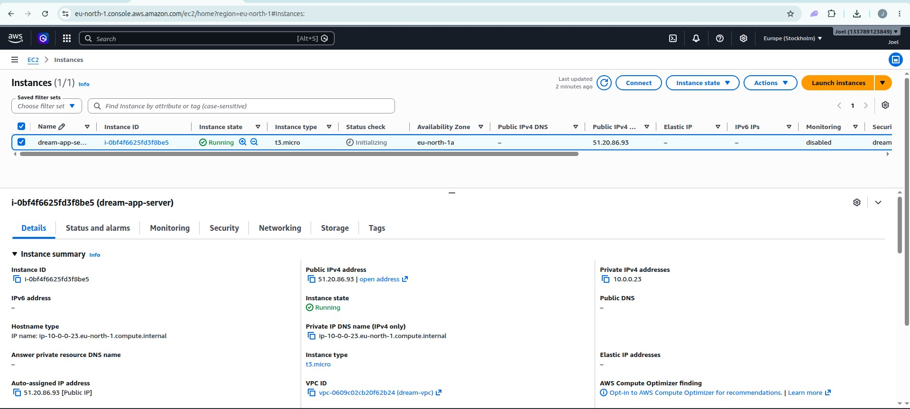

## Deployment through the pipeline

The existing GitHub Actions workflows for both frontend and backend were extended with a final deploy stage. This stage only runs after the build and image push stages succeed, and only when the change has landed on the main branch, not on dev. It connects to the EC2 instance over SSH using a dedicated key generated just for this purpose, pulls the freshly pushed Docker images, and restarts the app with Docker Compose.

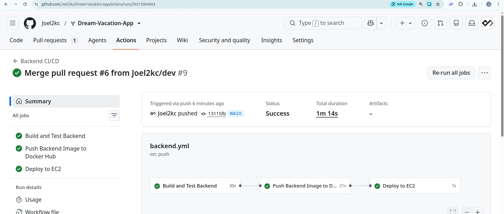

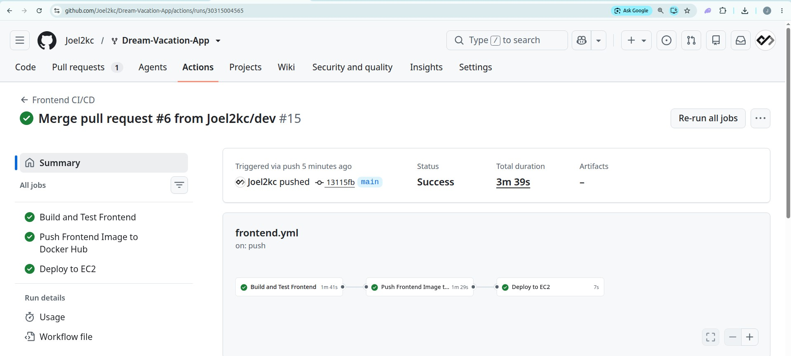

Keeping the deploy stage limited to main mirrors the same branching approach used earlier in the project. Dev is where changes get tested first, and only code that has already proven itself there gets merged in and allowed to touch the live server.

## Result

Once the pipeline completes, the updated app is live and reachable directly through the EC2 instance's public IP, with no manual steps required after the initial setup.

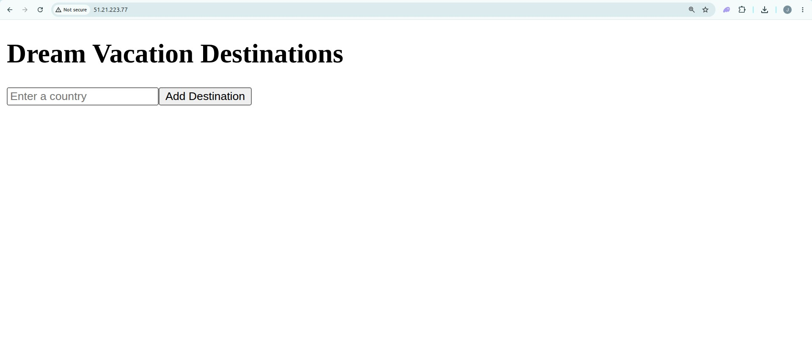


# AWS Infrastructure with Terraform Modules

## Overview

This section covers the second version of the AWS deployment for the Dream Vacation App, this time built entirely through Terraform instead of clicking through the console by hand. The networking, the EC2 instance, and CloudWatch monitoring are all defined as code and organized into separate modules, and the whole thing gets provisioned automatically through GitHub Actions whenever a change is pushed to the terraform folder on main.

## Why modules

Rather than writing every resource into one long file, the infrastructure is split into three self contained modules, one for networking, one for the EC2 instance and its security group, and one for CloudWatch. Each module only knows about its own piece and takes in whatever values it needs from outside, then hands back the specific outputs the rest of the setup depends on. The root configuration is what actually ties the three together, passing the VPC and subnet IDs from networking into the EC2 module, and passing the instance ID from EC2 into CloudWatch. This mirrors the exact order these things were built by hand originally, except now Terraform works out that order itself from how the resources reference each other.

## Networking module

```hcl
resource "aws_vpc" "this" {
  cidr_block = var.vpc_cidr

  tags = {
    Name = var.vpc_name
  }
}

resource "aws_subnet" "this" {
  vpc_id                  = aws_vpc.this.id
  cidr_block              = var.subnet_cidr
  map_public_ip_on_launch = true

  tags = {
    Name = var.subnet_name
  }
}

resource "aws_internet_gateway" "this" {
  vpc_id = aws_vpc.this.id

  tags = {
    Name = var.igw_name
  }
}

resource "aws_route_table" "this" {
  vpc_id = aws_vpc.this.id

  route {
    cidr_block = "0.0.0.0/0"
    gateway_id = aws_internet_gateway.this.id
  }

  tags = {
    Name = var.rt_name
  }
}

resource "aws_route_table_association" "this" {
  subnet_id      = aws_subnet.this.id
  route_table_id = aws_route_table.this.id
}
```

This module builds the VPC, subnet, internet gateway, route table, and the association between the route table and subnet, the same five pieces that were created manually in the console version of this project, just expressed as code this time.

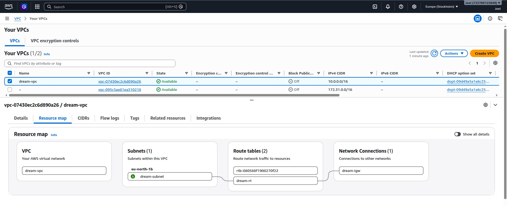

## EC2 module

```hcl
data "aws_ami" "ubuntu" {
  most_recent = true
  owners      = ["099720109477"]

  filter {
    name   = "name"
    values = ["ubuntu/images/hvm-ssd/ubuntu-jammy-22.04-amd64-server-*"]
  }
}

resource "aws_security_group" "this" {
  name        = var.sg_name
  description = "Allow SSH and HTTP"
  vpc_id      = var.vpc_id

  ingress {
    description = "SSH"
    from_port   = 22
    to_port     = 22
    protocol    = "tcp"
    cidr_blocks = ["0.0.0.0/0"]
  }

  ingress {
    description = "HTTP"
    from_port   = 80
    to_port     = 80
    protocol    = "tcp"
    cidr_blocks = ["0.0.0.0/0"]
  }

  egress {
    from_port   = 0
    to_port     = 0
    protocol    = "-1"
    cidr_blocks = ["0.0.0.0/0"]
  }

  tags = {
    Name = var.sg_name
  }
}

resource "aws_instance" "this" {
  ami                         = data.aws_ami.ubuntu.id
  instance_type               = var.instance_type
  subnet_id                   = var.subnet_id
  vpc_security_group_ids      = [aws_security_group.this.id]
  associate_public_ip_address = true
  monitoring                  = true

  user_data = templatefile("${path.module}/user_data.sh", {
    ssh_public_key = var.ssh_public_key
  })

  tags = {
    Name = var.instance_name
  }
}
```

The AMI is looked up automatically rather than hardcoded, so it always grabs the latest Ubuntu LTS image instead of relying on an ID that goes stale over time. The instance boots with a user data script that installs Docker and Docker Compose and adds the pipeline's SSH key to the server automatically, so nothing needs to be configured on it by hand afterward. Setting monitoring to true also turns on the more frequent CloudWatch metric collection used later in this document.

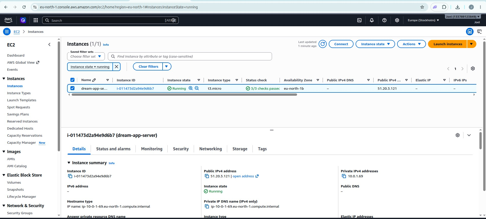

## CloudWatch module

```hcl
resource "aws_cloudwatch_metric_alarm" "high_cpu" {
  alarm_name          = var.alarm_name
  comparison_operator = "GreaterThanThreshold"
  evaluation_periods  = 2
  metric_name         = "CPUUtilization"
  namespace           = "AWS/EC2"
  period              = 300
  statistic           = "Average"
  threshold           = 80
  alarm_description   = "Triggers when CPU usage stays above 80 percent"

  dimensions = {
    InstanceId = var.instance_id
  }
}
```

CPU usage itself is tracked by AWS automatically for every instance without needing anything extra installed. This alarm watches that existing metric and would trigger if the average CPU usage stayed above 80 percent across two consecutive five minute windows.

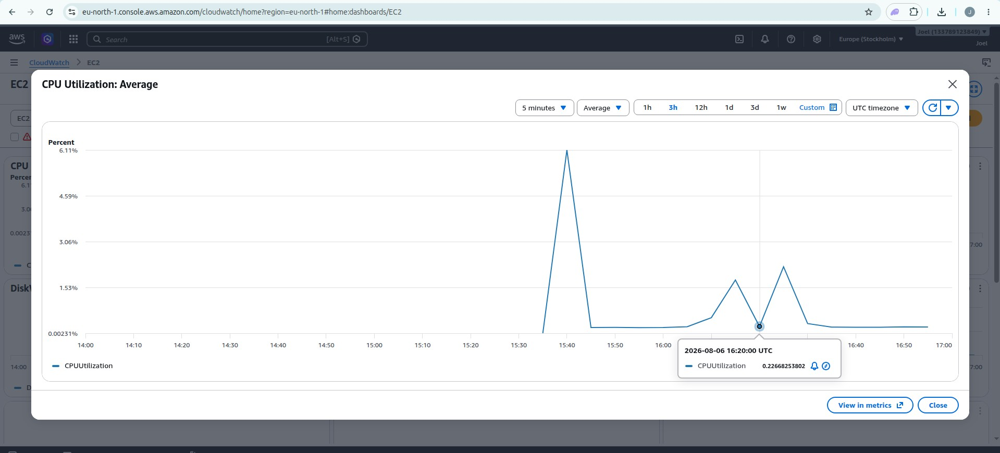

## Tying the modules together

```hcl
module "networking" {
  source = "./modules/networking"

  vpc_name    = "dream-vpc"
  vpc_cidr    = "10.0.0.0/16"
  subnet_name = "dream-subnet"
  subnet_cidr = "10.0.1.0/24"
  igw_name    = "dream-igw"
  rt_name     = "dream-rt"
}

module "ec2" {
  source = "./modules/ec2"

  instance_name  = "dream-app-server"
  instance_type  = "t3.micro"
  sg_name        = "dream-sg"
  vpc_id         = module.networking.vpc_id
  subnet_id      = module.networking.subnet_id
  ssh_public_key = var.ssh_public_key
}

module "cloudwatch" {
  source = "./modules/cloudwatch"

  alarm_name  = "dream-app-high-cpu"
  instance_id = module.ec2.instance_id
}
```

This is really where the whole structure comes together. The VPC and subnet IDs produced by the networking module get fed straight into the EC2 module, and the instance ID produced there gets fed into CloudWatch right after. Terraform reads these connections and figures out the correct build order on its own, without anyone needing to specify it directly.

## How the pipeline provisions this automatically

A dedicated workflow, Provision Infrastructure, watches for any push to main that touches the terraform folder. When that happens, it authenticates with AWS using credentials stored in GitHub Secrets, then runs terraform init, terraform plan, and terraform apply in sequence, building the entire environment from nothing.

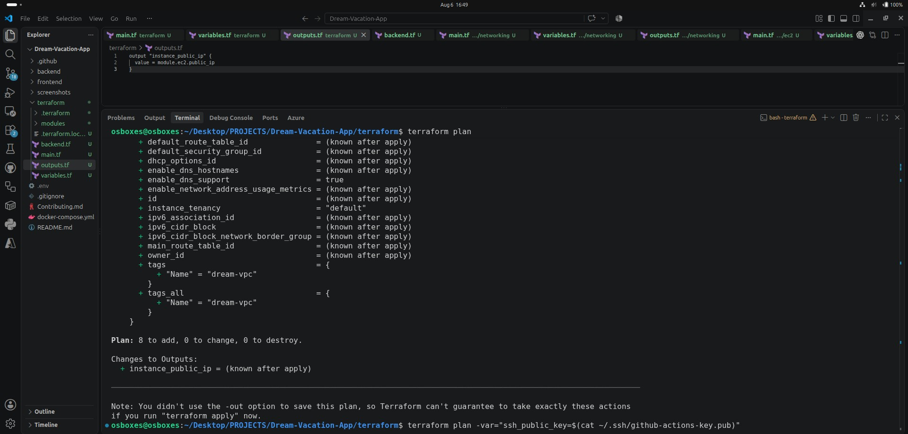

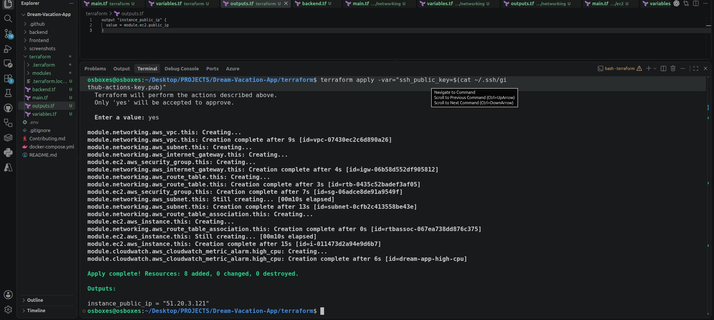

Once the infrastructure exists, the same backend and frontend pipelines that already build and push Docker images now also read the freshly created instance's IP directly from Terraform's remote state, copy the docker-compose.yml file across, and restart the app using the newly pushed images, all without anyone needing to log into the server manually.

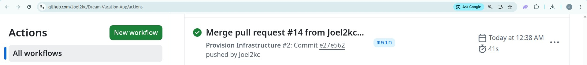

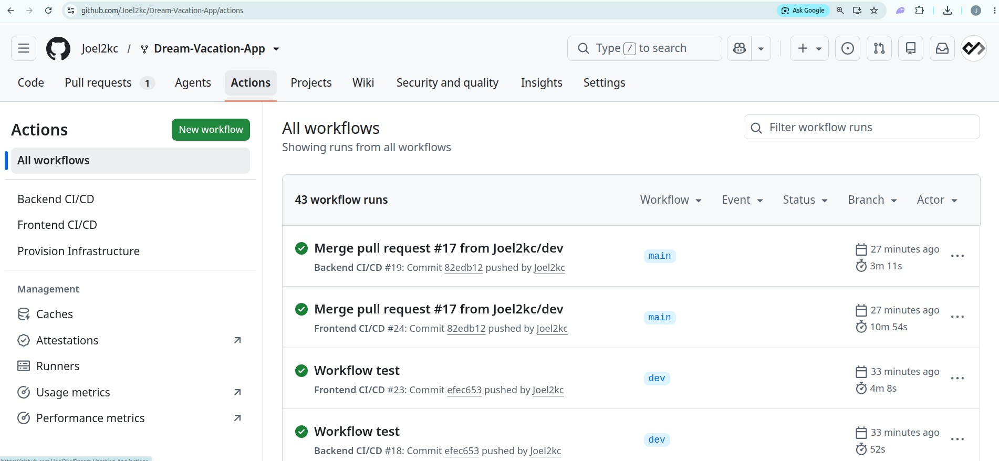

## Result

Once the pipeline finishes, the app is live on the instance Terraform created, reachable directly through its public IP with no manual setup required afterward.

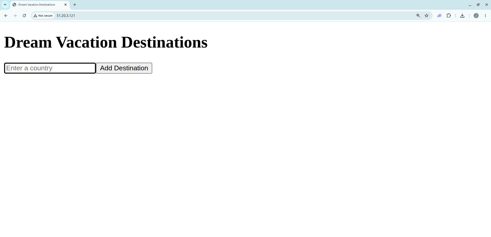
